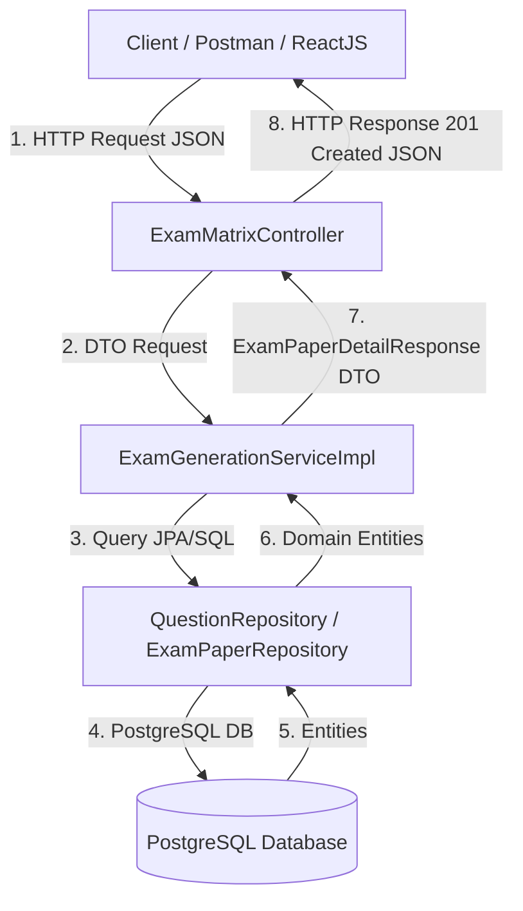

# 📚 HƯỚNG DẪN HỌC & GIẢI THÍCH CHI TIẾT CÁCH HOẠT ĐỘNG
## PHÂN HỆ SINH VÀ LƯU ĐỀ THI (DỰ ÁN EXAM MATRIX)

Tài liệu này được biên soạn nhằm giải thích **chi tiết từng dòng code, tư duy thiết kế kiến trúc (Architecture design)** và **nguyên lý hoạt động** của Phân hệ Sinh đề thi. Bạn có thể sử dụng tài liệu này để tự học, hiểu sâu bản chất và trả lời vấn đề khi bảo vệ đồ án/code review.

---

## 🏛️ 1. TỔNG QUAN KIẾN TRÚC HỆ THỐNG (CONTROLLER - SERVICE - REPOSITORY)

Hệ thống Spring Boot tuân theo kiến trúc 3 tầng chuẩn doanh nghiệp (Layered Architecture):



* **Controller (Tầng Tiếp Nhận):** Nhận HTTP Request từ client, validate dữ liệu đầu vào (`@Valid`), không chứa logic nghiệp vụ nặng.
* **Service (Tầng Nghiệp Vụ - Business Logic):** Nơi chứa toàn bộ thuật toán sinh đề, hoán vị, xáo trộn, kiểm tra quyền và quản lý Transaction.
* **Repository (Tầng Dữ Liệu):** Giao tiếp với Cơ sở dữ liệu PostgreSQL thông qua Spring Data JPA, chuyển đổi lệnh Java thành các câu truy vấn SQL.
* **DTO (Data Transfer Object):** Đối tượng truyền tải dữ liệu, giúp tách biệt bảng DB bên trong với định dạng JSON trả ra bên ngoài.

---

## 🔍 2. GIẢI THÍCH CHI TIẾT TỪNG FILE MÃ NGUỒN

---

### 🟢 2.1. File `ExamType.java` (Enum)
**Đường dẫn:** `backend/src/main/java/com/exammatrix/backend/entity/enums/ExamType.java`

```java
package com.exammatrix.backend.entity.enums;

public enum ExamType {
    OBJECTIVE, // Đề trắc nghiệm (bao gồm SINGLE_CHOICE, MULTIPLE_CHOICE, TRUE_FALSE)
    ESSAY      // Đề tự luận (chỉ bao gồm ESSAY)
}
```
* **Tại sao dùng Enum?** 
  Enum giúp định nghĩa một tập hợp các giá trị hằng số cố định. Tránh việc dùng chuỗi String tự do (như `"trac_nghiem"`, `"tu_luan"`) dễ gây lỗi chính tả runtime.

---

### 🟢 2.2. File `Question.java` & `ExamMatrix.java` (JPA Entity)

#### **File `Question.java`**
```java
@Column(name = "reference_answer", columnDefinition = "TEXT")
private String referenceAnswer;
```
* **Ý nghĩa:** Thêm cột `reference_answer` trong cơ sở dữ liệu với kiểu dữ liệu `TEXT` (cho phép lưu chuỗi dài đến 10.000 ký tự). Dùng lưu đáp án tham khảo của giáo viên cho câu hỏi tự luận.

#### **File `ExamMatrix.java`**
```java
@Enumerated(EnumType.STRING)
@Column(name = "exam_type", length = 20, nullable = false)
@Builder.Default
private ExamType examType = ExamType.OBJECTIVE;
```
* **`@Enumerated(EnumType.STRING)`:** Lưu tên dạng chuỗi `"OBJECTIVE"` hoặc `"ESSAY"` vào bảng DB thay vì lưu số thứ tự `0` hay `1` (giúp DB dễ đọc và bảo trì hơn).

---

### 🟢 2.3. File `PaperQuestionResponse.java` (DTO Trả Về)

```java
public class PaperQuestionResponse {
    private UUID id;
    private Integer questionOrder;
    private String content;
    private QuestionType type;
    private Difficulty difficulty;
    private List<AnswerResponse> answers;
    private String referenceAnswer; // Bổ sung cho tự luận
}
```
* **Tại sao không trả về trực tiếp Entity `Question` mà phải dùng DTO `PaperQuestionResponse`?**
  1. **Bảo mật & Tránh lặp vô tận (Circular Reference):** Entity `Question` chứa quan hệ `@ManyToOne` với `Teacher`, `@OneToMany` với `Answer`, nếu serialize trực tiếp sang JSON sẽ dễ gây tràn bộ nhớ (StackOverflowError).
  2. **Tùy biến dữ liệu:** Với câu hỏi Tự luận (`ESSAY`), danh sách `answers` trả về mảng rỗng `[]` và hiển thị `referenceAnswer`. Với câu Trắc nghiệm, `referenceAnswer` là `null` và `answers` trả về danh sách các lựa chọn A/B/C/D.

---

### 🟢 2.4. File `QuestionRepository.java` (Truy Vấn Spring Data JPA)

```java
@EntityGraph(attributePaths = "answers")
List<Question> findAllByChapter_IdAndDifficultyAndTypeIn(
        Integer chapterId,
        Difficulty difficulty,
        List<QuestionType> types
);
```
* **Nguyên lý hoạt động của Spring Data JPA:**
  Spring sẽ tự động phân tích tên phương thức (Method Name Parsing) và sinh ra câu lệnh SQL tương đương:
  ```sql
  SELECT q.*, a.* 
  FROM questions q 
  LEFT JOIN answers a ON q.id = a.question_id
  WHERE q.chapter_id = ? 
    AND q.difficulty = ? 
    AND q.type IN ('SINGLE_CHOICE', 'MULTIPLE_CHOICE', 'TRUE_FALSE');
  ```
* **`@EntityGraph(attributePaths = "answers")`:** Giúp giải quyết **vấn đề N+1 Query** nổi tiếng trong JPA bằng cách JOIN lấy sẵn luôn danh sách đáp án `answers` trong 1 câu SQL duy nhất.

---

### 🟢 2.5. File `ExamGenerationServiceImpl.java` (Trái Tim Của Thuật Toán Sinh Đề)

Đây là nơi thực thi logic quan trọng nhất. Hãy cùng phân tích chi tiết từng đoạn code:

#### **A. Khai báo Danh sách nhóm loại đề (Static Final Constants):**
```java
private static final List<QuestionType> OBJECTIVE_TYPES = List.of(
        QuestionType.SINGLE_CHOICE,
        QuestionType.MULTIPLE_CHOICE,
        QuestionType.TRUE_FALSE
);

private static final List<QuestionType> ESSAY_TYPES = List.of(
        QuestionType.ESSAY
);
```
* Nếu ma trận có `examType == ESSAY`, thuật toán sẽ chỉ dùng `ESSAY_TYPES`. Nếu `OBJECTIVE`, sẽ lấy 3 loại trắc nghiệm.

#### **B. Kiểm tra Quyền Truy Cập (Security Authorization):**
```java
private void checkCanAccess(ExamMatrix matrix, User currentUser) {
    if (isAdmin(currentUser)) {
        return; // Admin có toàn quyền
    }

    boolean isTeacherOwner = "TEACHER".equalsIgnoreCase(currentUser.getRole().getName())
            && matrix.getTeacher().getId().equals(currentUser.getId());

    if (!isTeacherOwner) {
        throw new ResponseStatusException(
                HttpStatus.FORBIDDEN,
                "Bạn không có quyền sinh đề cho ma trận này"
        );
    }
}
```
* Đảm bảo giáo viên A không thể sinh đề từ ma trận của giáo viên B.

#### **C. Thuật toán Rút trích & Xáo trộn Câu hỏi (`selectQuestionsForPaper`):**
```java
for (ExamMatrixConfig config : matrix.getConfigs()) {
    // 1. Query lấy ứng viên thỏa mãn chương, độ khó và nhóm loại câu
    List<Question> candidates = new ArrayList<>(
            questionRepository.findAllByChapter_IdAndDifficultyAndTypeIn(
                    config.getChapter().getId(),
                    config.getDifficulty(),
                    allowedTypes
            )
    );

    // 2. Kiểm tra số lượng trong kho
    if (candidates.size() < config.getQuantity()) {
        throw new ResponseStatusException(HttpStatus.CONFLICT, "Không đủ câu hỏi...");
    }

    // 3. Xáo trộn danh sách ứng viên (Algorithm: Fisher-Yates Shuffle)
    Collections.shuffle(candidates, secureRandom);

    // 4. Chọn ngẫu nhiên đủ số lượng và chống trùng lặp ID bằng HashSet
    int added = 0;
    for (Question candidate : candidates) {
        if (selectedQuestionIds.add(candidate.getId())) {
            selectedQuestions.add(candidate);
            added++;
        }
        if (added == config.getQuantity()) break;
    }
}

// 5. Xáo trộn tổng thể toàn bộ các câu trong đề thi một lần nữa
Collections.shuffle(selectedQuestions, secureRandom);
```
* **Chống trùng lặp:** `selectedQuestionIds.add(candidate.getId())` sử dụng cấu trúc `HashSet` để đảm bảo trong cùng 1 đề thi không bị lặp lại câu hỏi nào.
* **`Collections.shuffle(..., secureRandom)`:** Sử dụng `SecureRandom` mã hóa an toàn để đảm bảo tính ngẫu nhiên tuyệt đối, không đoán trước được vị trí câu hỏi.

#### **D. Thuật toán Sinh Mã Đề 6 Chữ Số Duy Nhất (`generateExamCode`):**
```java
private String generateExamCode(UUID matrixId, Set<String> codesInCurrentRequest) {
    for (int attempt = 0; attempt < 100; attempt++) {
        String code = String.format(Locale.ROOT, "%06d", secureRandom.nextInt(1_000_000));

        boolean alreadyUsed = codesInCurrentRequest.contains(code)
                || examPaperRepository.existsByExamMatrix_IdAndExamCode(matrixId, code);

        if (!alreadyUsed) {
            codesInCurrentRequest.add(code);
            return code;
        }
    }
    throw new ResponseStatusException(HttpStatus.CONFLICT, "Không thể tạo mã đề duy nhất");
}
```
* **Cơ chế:** Sinh chuỗi số ngẫu nhiên 6 chữ số (ví dụ `"023419"`). Kiểm tra xem mã này đã tồn tại trong CSDL của ma trận đó hay chưa. Nếu trùng sẽ sinh lại (thử tối đa 100 lần).

#### **E. Xáo trộn Đáp án A, B, C, D cho từng câu trắc nghiệm:**
```java
if (isEssay) {
    referenceAnswer = question.getReferenceAnswer();
} else {
    List<Answer> answers = new ArrayList<>(question.getAnswers());
    Collections.shuffle(answers, secureRandom); // Trộn ngẫu nhiên thứ tự đáp án A/B/C/D

    for (Answer answer : answers) {
        answerResponses.add(new AnswerResponse(
                answer.getId(),
                answer.getContent(),
                answer.getIsCorrect()
        ));
    }
}
```
* Giúp các mã đề trắc nghiệm khác nhau có thứ tự đáp án A, B, C, D hoàn toàn khác nhau.

#### **F. Quản lý Giao Dịch (`@Transactional`):**
```java
@Override
@Transactional
public List<ExamPaperDetailResponse> generateExamPapers(...) { ... }
```
* **Tính toàn vẹn (ACID - Atomicity):** Khi người dùng yêu cầu sinh 5 mã đề thi, toàn bộ 5 mã đề phải được tạo và lưu thành công. Nếu giữa chừng mã đề thứ 4 gặp lỗi, Spring Boot sẽ tự động **Rollback toàn bộ**, không lưu dở dang 3 đề trước vào CSDL.

---

### 🟢 2.6. File `ExamMatrixController.java` (REST Endpoint)

```java
@PostMapping("/{id}/generate")
public ResponseEntity<List<ExamPaperDetailResponse>> generateExamPapers(
        @PathVariable UUID id,
        @Valid @RequestBody GenerateExamPapersRequest request
) {
    List<ExamPaperDetailResponse> responses = examGenerationService.generateExamPapers(id, request);
    return ResponseEntity.status(HttpStatus.CREATED).body(responses);
}
```
* **`@PostMapping("/{id}/generate")`:** Nhận yêu cầu HTTP POST tại đường dẫn `/exam-matrices/{id}/generate`.
* **`@Valid`:** Kích hoạt kiểm tra validation tự động (`@Min(1) @Max(20)` trên `numberOfPapers`). Nếu vi phạm, Spring sẽ chặn ngay từ Controller và trả về lỗi `400 Bad Request`.
* **`ResponseEntity.status(HttpStatus.CREATED)`:** Trả về HTTP Code `201 Created` đúng chuẩn RESTful API khi tạo mới tài nguyên thành công.

---

### 🟢 2.7. File `ExamGenerationServiceTest.java` (Kiểm Thử Đơn Vị Unit Test)

```java
@ExtendWith(MockitoExtension.class)
class ExamGenerationServiceTest {
    @Mock private ExamPaperRepository examPaperRepository;
    @Mock private ExamMatrixRepository examMatrixRepository;
    @Mock private QuestionRepository questionRepository;
    @Mock private CurrentUserService currentUserService;

    @InjectMocks private ExamGenerationServiceImpl examGenerationService;
```
* **`@Mock` (Giả lập):** Tạo các đối tượng giả lập cho Repository và Security để test độc lập logic của Service mà không cần kết nối tới Database thật.
* **`@InjectMocks`:** Tự động tiêm các đối tượng `@Mock` vào `ExamGenerationServiceImpl`.
* **`when(...).thenReturn(...)`:** Quy định hành vi giả lập. Ví dụ: *"Khi gọi `currentUserService.getCurrentUser()`, hãy trả về `teacherUser` này"*.
* **`assertThrows(...)`:** Kiểm tra xem dịch vụ có ném ra đúng ngoại lệ mong đợi (404, 403, 409, 400) khi gặp dữ liệu lỗi hay không.

---

## 📋 3. BẢNG CHECKLIST CÁC BƯỚC THỰC HIỆN ĐỂ HỌC LẠI LOGIC

- [x] **Bước 1: Nắm cấu trúc DTO vs Entity** (Xem `Question.java` vs `PaperQuestionResponse.java`).
- [x] **Bước 2: Hiểu cách Enum phân loại đề** (Xem `ExamType.java` vs `QuestionType.java`).
- [x] **Bước 3: Hiểu truy vấn động JPA** (Xem `QuestionRepository.java`).
- [x] **Bước 4: Nắm vững 10 bước thuật toán sinh đề** (Xem `ExamGenerationServiceImpl.java`).
- [x] **Bước 5: Hiểu cơ chế xáo trộn Fisher-Yates & chống trùng bằng HashSet** (Xem `Collections.shuffle`).
- [x] **Bước 6: Nắm vững vai trò `@Transactional` & `@Valid`** (Xem Service & Controller).
- [x] **Bước 7: Hiểu kỹ thuật Mockito trong Unit Test** (Xem `ExamGenerationServiceTest.java`).

---

## 💡 LỜI KHUYÊN KHI BẢO VỆ ĐỒ ÁN / CODE REVIEW
1. Khi thầy cô/trưởng nhóm hỏi: *"Thuật toán xáo trộn câu hỏi và đáp án làm như thế nào?"*
   $\rightarrow$ Trả lời: *"Em sử dụng phương thức `Collections.shuffle` kết hợp với `SecureRandom` để hoán vị mảng theo thuật toán Fisher-Yates, giúp thứ tự câu hỏi và thứ tự đáp án A/B/C/D hoàn toàn ngẫu nhiên và an toàn."*
2. Khi hỏi: *"Làm sao để sinh 5 đề thi mà không bị lưu dở dang khi bị lỗi?"*
   $\rightarrow$ Trả lời: *"Em bọc toàn bộ phương thức sinh đề trong annotation `@Transactional`. Nếu có bất kỳ đề thi nào gặp lỗi giữa chừng, Spring Boot sẽ tự động rollback toàn bộ giao dịch về trạng thái ban đầu."*
